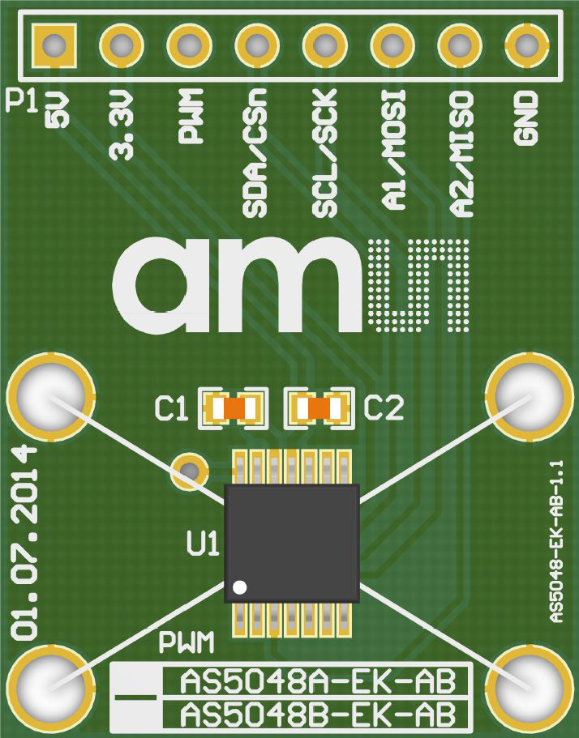

 

**Th**e **AS50**48A **i**s **a**n **ea**sy **t**o **us**e **36**0° **ang**le **posi**tion **sen**sor **(abso**lute **enco**der) **wi**th **a** **14-**bit **hi**gh **resol**ution **out**put **an**d **SP**I **inter**face. **Th**e **maxi**mum **sys**tem **accu**racy **i**s **0.0**5° 

### One device SPI mode

**MCU			              Adafruit ESP32 Feather**

3.3V/5V  <------------- VCC

SDA        <------------- A5 / pin 4

SCK        <------------- SCK / pin 5

MOSI     <------------- MOSI / pin 18

MISO    <------------- MISO / pin 19

