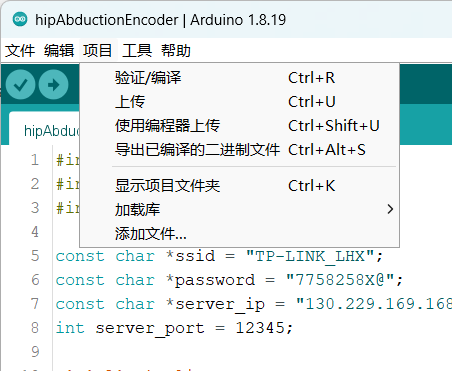
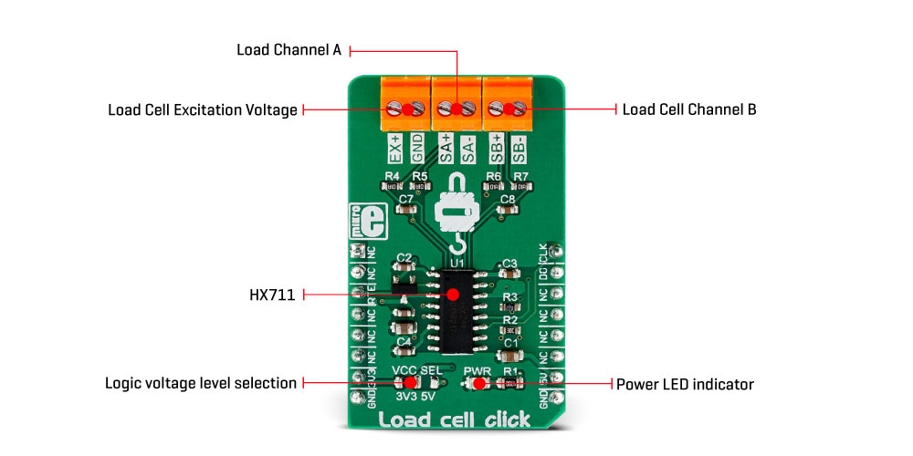
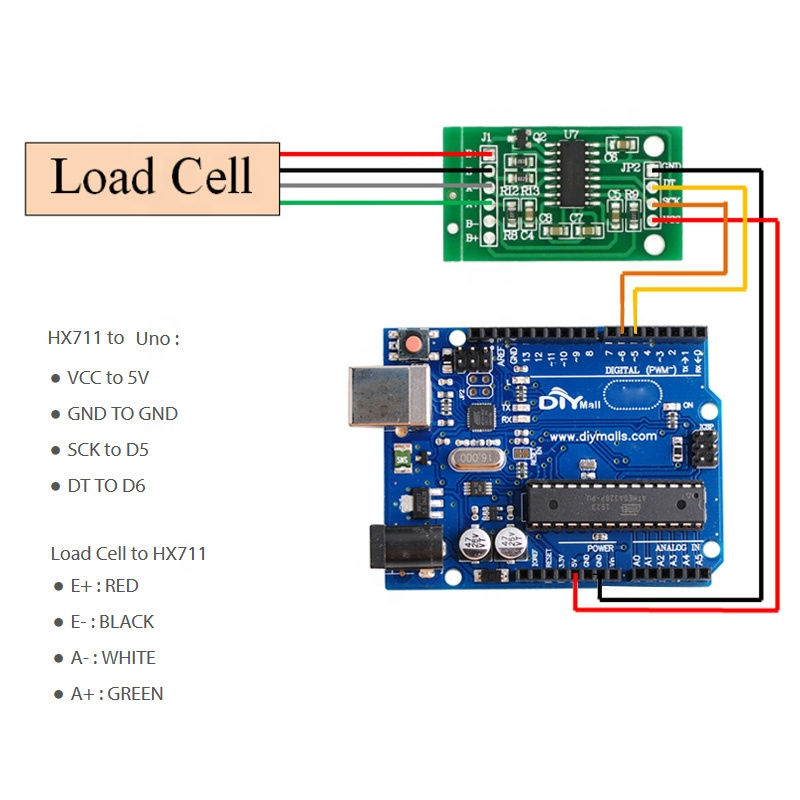

[**Preci**sion **AD**Cs](https://www.ti.com/data-converters/adc-circuit/precision-adcs/overview.html?keyMatch=&tisearch=search-everything&usecase=partmatches)

### ESP32 - 80Hz solution

**LIb requirement**

HX711：   [HX711-master.zip](esp32\loadcell\lib\HX711-master.zip) 

**code** 

 [loadcell.ino](loadcell\loadcell.ino) 

**hardware**

*ADC and amplifier*

  

图 board information refers to its [official website](https://www.mikroe.com/load-cell-click). **RTE pin** is used to select speed of output,  80 samples per second (high) or 10 Hz

 

*load cell 200kg capability* 

  

*microcontroller  adafruit ESP32 Feather*  

 

*Connection*  

 

